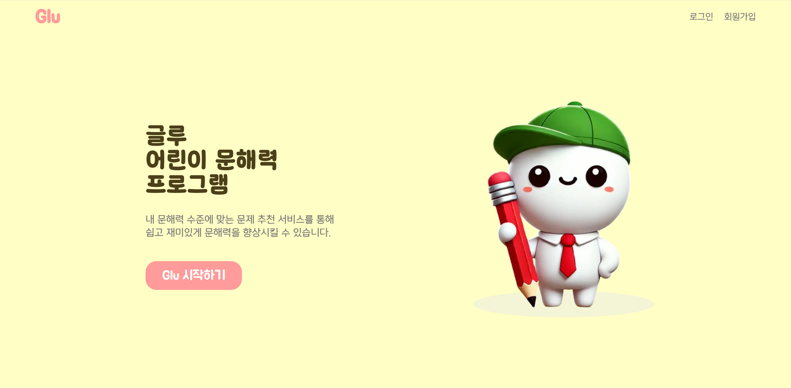
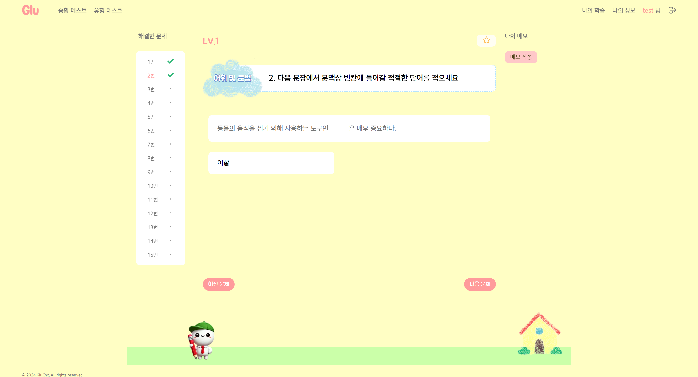
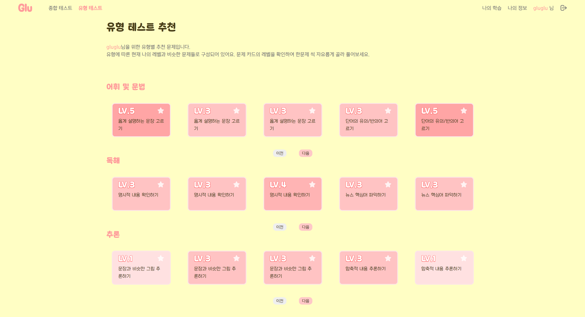
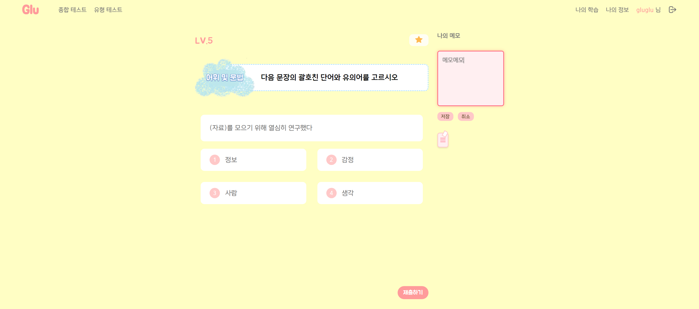
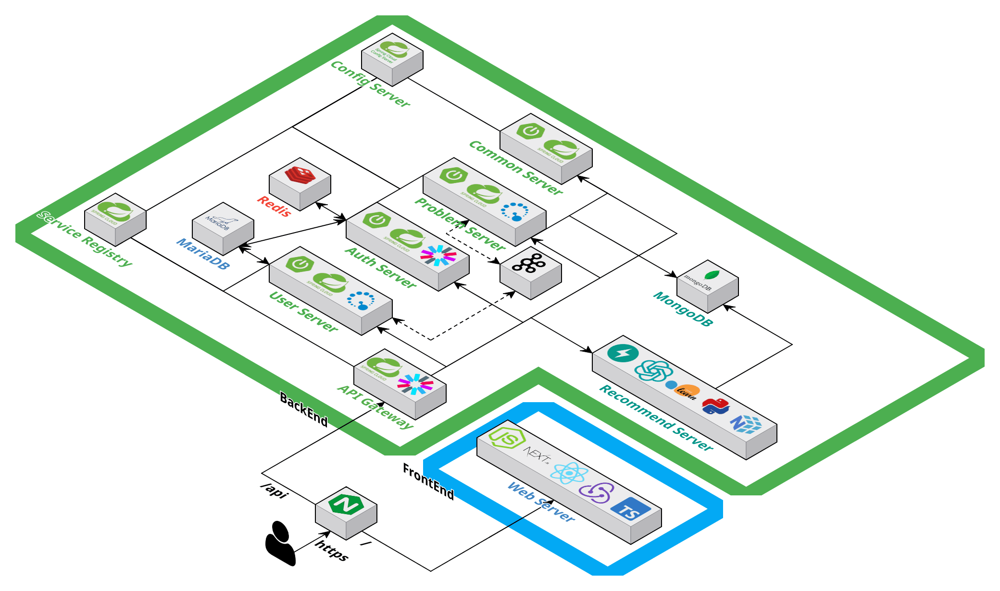
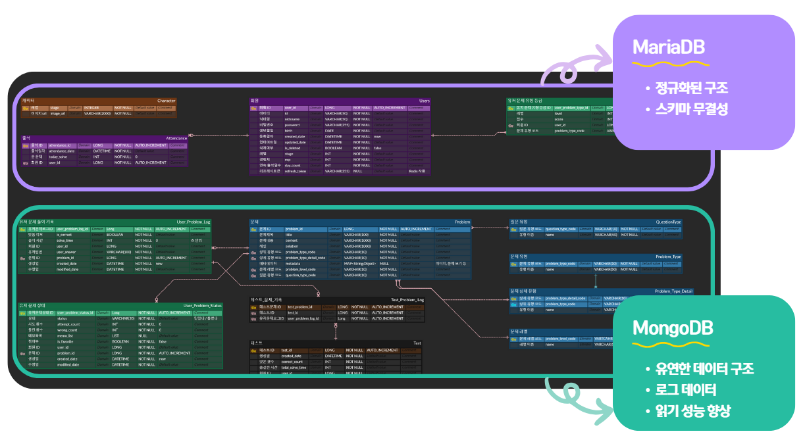

  <h1>GLU - 문해력 진단 및 학습 서비스</h1>
  
📚 어린이들을 위한 문해력 진단 및 문제 추천 플랫폼 📚

  
👑 SSAFY 특화 프로젝트 최우수상 수상 👑

 

> **서비스 바로가기**: https://j11a506.p.ssafy.io/

 

  <a href="https://j11a506.p.ssafy.io/">홈페이지</a>
  &nbsp; | &nbsp;
  <a href="https://j11a506.p.ssafy.io/webjars/swagger-ui/index.html">Swagger</a>
  &nbsp; | &nbsp;
  <a href="https://ssafy.atlassian.net/jira/software/c/projects/S11P21A506/boards/7138">Jira</a>
  &nbsp; | &nbsp;
  <a href="https://ssafy-second-project.notion.site/1c04fb60d1af4f8e8a7b53cc3e06b27d">Notion</a>

 

## ✍️ 프로젝트 개요

- **프로젝트명:** GLU
- **프로젝트 기간:** 2024.08.19 ~ 2024.10.11
- **SSAFY 11기 특화 프로젝트**
- **목표:** 어린이의 문해력 수준을 진단하고 개인 맞춤형 문제 추천을 제공하여 문해력을 향상시키는 플랫폼

---

## ✍️ 프로젝트 소개

### 프로젝트 배경

최근 문해력의 중요성이 대두되면서, 어린이의 문해력을 효과적으로 평가하고 개선할 필요성이 커졌습니다. 기존 문해력 진단 서비스는 단순한 진단에 그치거나 훈련 기능이 부족한 경우가 많았습니다.

GLU는 이러한 문제를 해결하고자 어린이의 반복 학습을 통해 문해력을 향상시키는 맞춤형 학습 플랫폼을 제공합니다.

### 문제점 해결

- 맞춤형 진단 및 학습 경로 제공: 학습자가 진단 결과를 바탕으로 자신의 수준에 맞는 문제를 추천받고 자율적으로 학습할 수 있는 환경을 조성
- 통합 학습 환경 제공: 진단과 훈련을 함께 제공하여 학습자가 진단 결과를 통해 적절한 훈련을 할 수 있도록 지원
- 학습 도구 제공: 오답노트, 문제 스크랩, 시각적 성장 기록을 통해 학습 동기 부여

---

## 🚀 프로젝트 목표

- **문해력 진단 및 맞춤형 문제 추천**: 어린이의 문해력 수준을 종합적으로 평가하고 적절한 학습 문제를 제시
- **학습 성과 시각화 및 동기부여**: 캐릭터 성장 시스템과 출석 포인트를 통해 학습에 대한 흥미를 유지
- **효과적인 학습 지원 도구 제공**: 메모, 오답노트 등을 통해 지속적인 학습 개선

## 📊 기대 효과

### 플랫폼

- **사용자 맞춤형 학습 환경**: 학습 이력에 따른 맞춤형 문제를 제공하여 학습 몰입도 향상
- **반복 학습을 통한 지속적인 향상**: 다양한 문제 유형을 제공하여 자기 주도 학습을 강화

### 학습자

- **다양한 학습 콘텐츠 제공**: 문해력의 여러 영역(독해, 어휘, 문법 등)을 포함한 문제를 제공하여 균형 잡힌 학습 지원
- **시각적 성장 기록을 통한 성취감 증대**: 학습 성과를 시각적으로 제공하여 학습 동기를 유발

---

## 📌 주요 기능

**문해력 레벨 테스트:** 초기 레벨 테스트를 통해 사용자의 문해력 수준을 평가

**맞춤형 문제 추천:** 사용자의 학습 이력과 수준에 맞춘 문제를 추천하여 효과적인 학습 지원

**메모 및 학습 이력 확인:** 문제 풀이 중 메모 기능을 제공하고, 학습 이력을 기록하여 다시 학습할 수 있도록 지원

**캐릭터 성장 시스템:** 학습 성과에 따라 캐릭터가 성장하며, 학습 흥미를 유지

**출석 포인트 시스템:** 매일 학습 참여를 독려하는 출석 체크 및 포인트 제공

---

## 🧑‍💻 팀원 소개

|                   **이서빈**                   |               **강민제**               |                **김규태**                |              **임세하**              |                   **조서영**                   |               **한수한**               |
| :--------------------------------------------: | :------------------------------------: | :--------------------------------------: | :----------------------------------: | :--------------------------------------------: | :------------------------------------: |
| [@leeseobin00](https://github.com/leeseobin00) | [@gogizoa](https://github.com/gogizoa) | [@wavekt98](https://github.com/wavekt98) | [@sehaim](https://github.com/sehaim) | [@seoyoung927](https://github.com/seoyoung927) | [@sem1308](https://github.com/sem1308) | [@sem1308](https://github.com/sem1308) |
|                   팀장 & BE                    |                   BE                   |                    BE                    |                  FE                  |                       FE                       |               BE & Infra               |
|                   문제, 공통                   |           회원, 인증, 데이터           |               데이터, 추천               |            홈, 회원, 추천            |                홈, 테스트, 추천                |              문제, Infra               |

---

## ⚙️ 기술 스택

<table>
    <thead>
        <tr>
            <th>분류</th>
            <th>기술 스택</th>
        </tr>
    </thead>
    <tbody>
        <tr>
            <td>프론트엔드</td>
            <td>
                
                
                
                
            </td>
        </tr>
        <tr>
            <td>백엔드</td>
            <td>
                
                
                
                
                
                
            </td>
        </tr>
        <tr>
            <td>데이터베이스</td>
            <td>
                
                
                
            </td>
        </tr>
        <tr>
            <td>데이터</td>
            <td>
                
                
                
                
                
            </td>
        </tr>
        <tr>
            <td>메시지 큐</td>
            <td>
                
            </td>
        </tr>
        <tr>
            <td>인프라</td>
            <td>
                
                
                
                
                
            </td>
        </tr>
        <tr>
            <td>협업 도구</td>
            <td>
                
                
                
                
            </td>
        </tr>
    </tbody>
</table>

---

## 🔨 시스템 아키텍처

GLU는 마이크로서비스 아키텍처(MSA)로 구성되어 있으며, 각 서비스가 독립적으로 운영되어 유연성과 확장성을 제공합니다.

---

## 📊 데이터베이스 설계

- **MariaDB:** 정형화된 사용자 정보 저장
- **MongoDB:** 유연한 문제 데이터 저장 (객관식, 단답식 등 다양한 문제 유형 지원)

---

## 📂 문서 자료

- [포팅 메뉴얼](./exec/GLU_포팅_메뉴얼.md)
- [시연 시나리오](./exec/11기_특화PJT_시연_시나리오_A506.pdf)
- [발표 자료](./exec/11기_특화PJT_발표자료_A506.pdf)
- [DATA](./exec/data)

---

## 🌐 유튜브 링크

  

---
